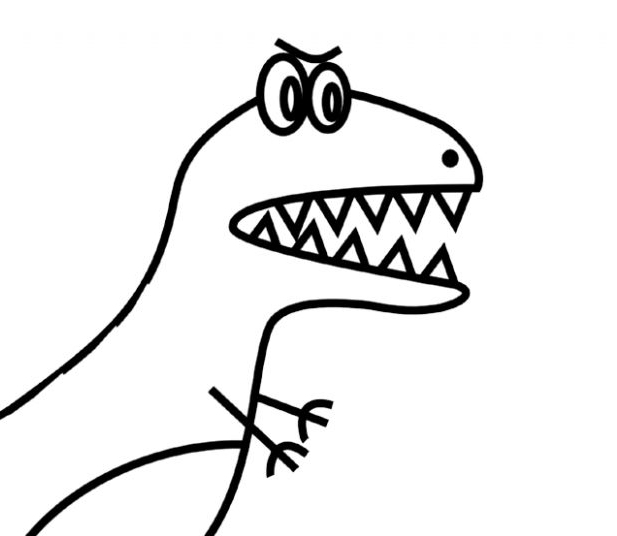

# RexBot

### This is my first big project written in Python.   The Code is a bit messy, I start build this bot in the first days of learning!

#### I really need to review this one, but...someday! :) 

---

### The main goal of this bot is to help me and my coworkers in daily tasks in the company.

### With this bot we can easily check for references of materials, check tasks, resize images, generate passwords, get news feed in Design things, music and much more.
